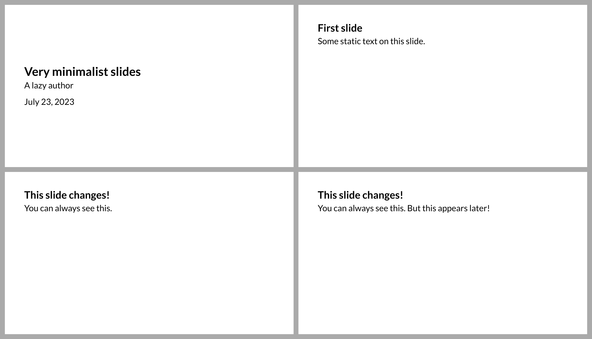

# Polylux
This is a package for creating presentation slides in [Typst](https://typst.app/).
Read the [book](https://polylux.dev/book) to learn all
about it and click [here](https://polylux.dev/book/changelog.html)
to see what's new!

If you like it, consider [giving a star on GitHub](https://github.com/andreasKroepelin/polylux)!

[](https://polylux.dev/book)


[](https://github.com/andreasKroepelin/polylux/releases/latest/download/demo.pdf)


## Quickstart
For the bare-bones, do-it-yourself experience, all you need is:
```typ
// Get Polylux from the official package repository
#import "@preview/polylux:0.4.0": *

// Make the paper dimensions fit for a presentation and the text larger
#set page(paper: "presentation-16-9")
#set text(size: 25pt, font: "Lato")

// Use #slide to create a slide and style it using your favourite Typst functions
#slide[
  #set align(horizon)
  = Very minimalist slides

  A lazy author

  July 23, 2023
]

#slide[
  == First slide

  Some static text on this slide.
]

#slide[
  == This slide changes!

  You can always see this.
  // Make use of features like #uncover, #only, and others to create dynamic content
  #uncover(2)[But this appears later!]
]
```
This code produces these PDF pages:


From there, you can either start creatively adapting the looks to your likings
or you directly start by using a
[template](https://typst.app/universe/search/?q=polylux&kind=templates).
The simplest one of them is called
["basic"](https://github.com/polylux-typ/basic).
It is still very unintrusive but gives you some sensible defaults.

For dynamic content, Polylux also provides [a convenient API for complex
overlays](https://polylux.dev/book/dynamic/dynamic.html).

If you use [pdfpc](https://pdfpc.github.io/) to display your slides, you can
rely on [Polylux' support for it](https://polylux.dev/book/external/pdfpc.html)
and create speaker notes, hide slides, configure the timer and more!

Visit the
[book](https://polylux.dev/book)
for more details or take a look at the
[demo PDF](https://github.com/andreasKroepelin/polylux/releases/latest/download/demo.pdf)
where you can see the features of this template in action.

**⚠ This package is under active development and there are no backwards
compatibility guarantees!**

## Acknowledgements
Various people have contributed to this package and I will certainly forget
someone here, but amongst others I would like to thank
[@rmburg](https://github.com/rmburg),
[@drupol](https://github.com/drupol),
[@Enivex](https://github.com/Enivex),
[@MarkBlyth](https://github.com/MarkBlyth),
[@ntjess](https://github.com/ntjess),
[@JuliusFreudenberger](https://github.com/JuliusFreudenberger), and
[@fncnt](https://github.com/fncnt) (who came up with the name _Polylux_).
