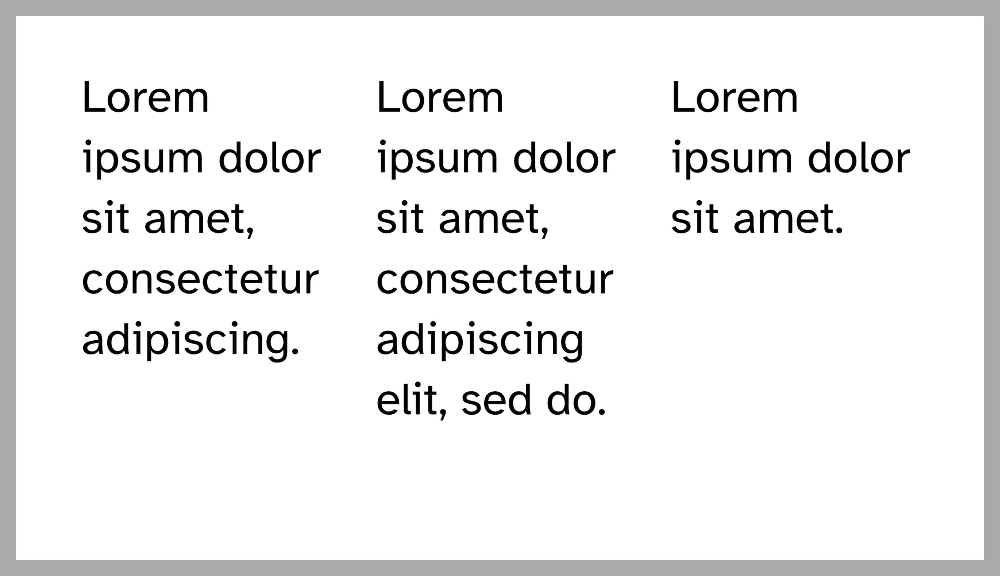

# Side by side
To make good use of the space on a slide, you will often want to place content
next to each other.
For convenience, `toolbox` provides the function `#side-by-side` for this
purpose.
It is basically a thin wrapper around the Typst function
[`#grid`](https://typst.app/docs/reference/layout/grid/) but tailored
towards this specific usecase.
In its simplest form, you can use it as
```typ
{{#include side-by-side.typ:6:12}}
```


As you can see, the content arguments you provide will be placed next to each
other with equal proportions of width.
A spacing (gutter) of `1em` will also be put between them.

The widths and gutter can be configured using the `columns` and `gutter`
optional arguments, respectively.
They are propagated to `#grid` directly so you can look up possible values in
its documentation
([`gutter`](https://typst.app/docs/reference/layout/grid/#parameters-gutter)
and
[`columns`](https://typst.app/docs/reference/layout/grid/#parameters-columns)
arguments).
If not specified, they fall back to these defaults:
- `gutter`: `1em`
- `columns`: `(1fr,) * n` if you provided `n` content arguments, that means an
  array with the value `1fr` repeated `n` times. 

A more complex example would therefore be:
```typ
{{#include side-by-side-kwargs.typ:6:12}}
```

